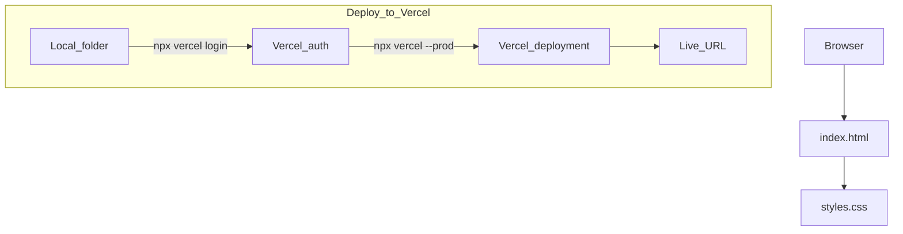

# hello-technest-website

A simple personal portfolio website built with plain **HTML + CSS** (no framework).

## What’s inside

- `index.html`: page structure + content (update the placeholders for your name, tagline, and links)
- `styles.css`: responsive styling, dark mode (`prefers-color-scheme`), accessible focus states

## Customize

Edit these in `index.html`:

- **Name**: currently `Magret` (header, hero, footer)
- **Links**:
  - `https://github.com/your-username`
  - `https://www.linkedin.com/in/your-username`
  - `mailto:you@example.com`
- **Text**: tagline + intro paragraph

## Diagram (Mermaid)



## Preview locally

Any static server works. Two easy options:

```bash
cd "/Users/Magret/Desktop/software-development/TechNest/learning-AI-ChanMeng/technest-week-1/hello-technest-website"

# Option A (Python)
python3 -m http.server 5173

# Option B (Node)
npx serve .
```

Then open `http://localhost:5173`.

## Deploy to Vercel

From this folder:

```bash
cd "/Users/Magret/Desktop/software-development/TechNest/learning-AI-ChanMeng/technest-week-1/hello-technest-website"

# First time only (sign in; opens browser)
npx vercel@latest login

# Deploy to production
npx vercel@latest --prod
```

## Vercel Deploy URL
```
hello-technest-website.vercel.app
```

Vercel will print your live URL in the output.

